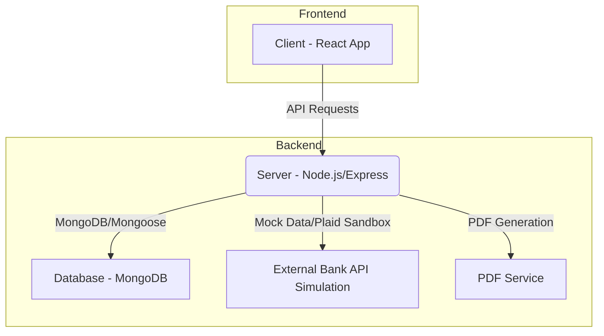

# Detailed Plan: Personal Finance Tracker

The objective is to build a full-stack Personal Finance Tracker with secure user authentication, bank integration (using mock data), intelligent spending insights, and various financial management features.

## High-Level Architecture

The application will follow a MERN (MongoDB, Express, React, Node.js) stack architecture.

## Key Features and Implementation Steps

### 1. 🔐 Authentication (Already partially implemented)

*   **Backend:**
    *   **User Model:** [`server/models/User.js`](server/models/User.js) exists. I will ensure it uses `bcrypt` for password hashing and has fields for `name`, `email`, and `password`.
    *   **Controllers:** [`server/controllers/authController.js`](server/controllers/authController.js) handles `registerUser` and `authUser` (login). These are in place.
    *   **Middleware:** [`server/middleware/authMiddleware.js`](server/middleware/authMiddleware.js) for JWT protection is implemented.
    *   **Routes:** [`server/routes/auth.js`](server/routes/auth.js) defines API endpoints for signup, login, and profile access.
    *   **JWT Generation:** [`server/utils/generateToken.js`](server/utils/generateToken.js) is present.
*   **Frontend:**
    *   **Login/Signup Pages:** [`client/src/pages/Login.jsx`](client/src/pages/Login.jsx) and [`client/src/pages/Signup.jsx`](client/src/pages/Signup.jsx) are present.
    *   **Auth Context:** [`client/src/context/AuthContext.jsx`](client/src/context/AuthContext.jsx) will manage user state and authentication logic.
    *   **API Utility:** [`client/src/utils/api.js`](client/src/utils/api.js) for authenticated requests.

### 2. 🔄 Bank Integration (Mock/Sandbox)

*   **Backend:**
    *   **New Controller:** Create `server/controllers/bankIntegrationController.js` to handle bank connection and transaction fetching.
    *   **Mock Data Service:** Enhance [`server/utils/mockData.js`](server/utils/mockData.js) to simulate bank account connection and generate a stream of transactions over time, not just for a single month. This will involve:
        *   A function to "connect" a bank account (e.g., `connectBank(userId)`).
        *   A function to "fetch" new transactions (e.g., `fetchTransactions(userId, lastFetchedDate)`).
    *   **Routes:** Add routes in `server/routes/bank.js` for connecting to a bank and fetching transactions.
*   **Frontend:**
    *   **Bank Connection Page/Modal:** Create a UI in `client/src/pages/BankConnect.jsx` (or a modal within Dashboard) for users to initiate bank connection.
    *   **Display Bank Status:** Show connected bank accounts (mock names) on the dashboard.

### 3. 📊 Transactions

*   **Backend:**
    *   **Transaction Model:** [`server/models/Transaction.js`](server/models/Transaction.js) exists. I will ensure it includes fields like `userId`, `description`, `amount`, `type` (income/expense), `category`, `date`, `isRecurring`, and potentially `bankAccountId`.
    *   **Controllers:** [`server/controllers/transactionController.js`](server/controllers/transactionController.js) exists. I will implement/enhance:
        *   `getTransactions`: Fetch transactions with pagination/filtering.
        *   `addTransaction`: Manually add a transaction.
        *   `updateTransaction`: Edit an existing transaction.
        *   `deleteTransaction`: Delete a transaction.
        *   `categorizeTransaction`: Logic for automatic categorization by keywords.
    *   **Routes:** [`server/routes/transactions.js`](server/routes/transactions.js) exists. I will define API endpoints for CRUD operations and categorization.
*   **Frontend:**
    *   **Transactions Page:** [`client/src/pages/Transactions.jsx`](client/src/pages/Transactions.jsx) is present. I will implement:
        *   Display list of transactions with pagination/infinite scroll.
        *   UI for adding, editing, and deleting transactions.
        *   Search and filter options.
        *   Categorization display and manual override.

### 4. 💸 Budgeting

*   **Backend:**
    *   **Budget Model:** [`server/models/Budget.js`](server/models/Budget.js) exists. I will ensure it includes `userId`, `category`, `amount` (budget limit), `month` (for monthly budgets).
    *   **Controllers:** [`server/controllers/budgetController.js`](server/controllers/budgetController.js) exists. I will implement:
        *   `setBudget`: Create or update a budget for a category/month.
        *   `getBudgets`: Retrieve user's budgets.
        *   `getBudgetUsage`: Calculate current spending against budgets.
    *   **Routes:** [`server/routes/budgets.js`](server/routes/budgets.js) exists. I will define API endpoints.
*   **Frontend:**
    *   **Budgets Page:** [`client/src/pages/Budgets.jsx`](client/src/pages/Budgets.jsx) is present. I will implement:
        *   UI to set monthly budgets per category.
        *   Display budget progress with color-coded bars (e.g., green for under, yellow for nearing, red for over).

### 5. 📈 Dashboard

*   **Backend:**
    *   **Controllers:** [`server/controllers/dashboardController.js`](server/controllers/dashboardController.js) exists. I will implement:
        *   `getFinancialSummary`: Calculate total income, expenses, net savings for a period.
        *   `getCategoryBreakdown`: Calculate spending per category.
        *   `getMonthlyTrends`: Data for income vs. expenses chart over time.
    *   **Routes:** [`server/routes/dashboard.js`](server/routes/dashboard.js) exists. I will define API endpoints.
*   **Frontend:**
    *   **Dashboard Page:** [`client/src/pages/Dashboard.jsx`](client/src/pages/Dashboard.jsx) is present. I will implement:
        *   Integrate Recharts for:
            *   Income vs. Expenses chart (line or bar).
            *   Pie chart of category breakdown.
        *   Display monthly summary (total spent, top categories).

### 6. 🎯 Financial Goals

*   **Backend:**
    *   **Goal Model:** [`server/models/Goal.js`](server/models/Goal.js) exists. I will ensure it includes `userId`, `name`, `targetAmount`, `savedAmount`, `targetDate`, `status`.
    *   **Controllers:** [`server/controllers/goalController.js`](server/controllers/goalController.js) exists. I will implement:
        *   `createGoal`: Create a new savings goal.
        *   `updateGoal`: Update goal progress or details.
        *   `getGoals`: Retrieve user's goals.
    *   **Routes:** [`server/routes/goals.js`](server/routes/goals.js) exists. I will define API endpoints.
*   **Frontend:**
    *   **Goals Page:** [`client/src/pages/Goals.jsx`](client/src/pages/Goals.jsx) is present. I will implement:
        *   UI to create and manage savings goals.
        *   Display progress towards goals.

### 7. 🔔 Alerts & Insights

*   **Backend:**
    *   **Alert Logic:** Integrate alert generation within `budgetController` (when fetching budget usage) and potentially a new `insightController`.
    *   **Insight Generation:** Develop logic to analyze spending patterns and suggest insights (e.g., "You spent X% more on food this month").
*   **Frontend:**
    *   **Notification System:** Display alerts on the dashboard or a dedicated alerts section.
    *   **Insight Display:** Show financial suggestions/insights on the dashboard.

### 8. 📑 PDF Reports

*   **Backend:**
    *   **PDF Utility:** [`server/utils/createReportPdf.js`](server/utils/createReportPdf.js) exists. I will enhance it to:
        *   Generate a PDF with monthly transactions.
        *   Include charts (income vs. expenses, category breakdown) using a library like `puppeteer` to render charts from HTML/SVG or a dedicated PDF charting library.
    *   **Controllers:** [`server/controllers/reportController.js`](server/controllers/reportController.js) exists. I will implement `generateMonthlyReport`.
    *   **Routes:** [`server/routes/reports.js`](server/routes/reports.js) exists. I will define API endpoint to trigger PDF generation and download.
*   **Frontend:**
    *   **Report Page:** [`client/src/pages/ReportPage.jsx`](client/src/pages/ReportPage.jsx) is present. I will implement:
        *   UI to select month and generate report.
        *   Link to download the generated PDF.

## Development Workflow

1.  **Backend Setup:**
    *   Verify existing models and controllers.
    *   Implement new controllers and routes for Bank Integration, Transactions (CRUD & Categorization), Budgeting, Goals, Dashboard, and Reports.
    *   Refine `mockData.js` for realistic transaction generation over time.
    *   Integrate `bcrypt` for password hashing in the User model (if not already done).
    *   Ensure JWT authentication protects all relevant routes.
2.  **Frontend Development:**
    *   Integrate Recharts into the Dashboard for visualizations.
    *   Develop UI for Bank Connection, Transactions (list, add, edit, delete, categorize), Budgeting, Goals, and Reports.
    *   Implement state management (AuthContext and potentially other contexts/Redux for data).
    *   Connect frontend components to backend APIs using `client/src/utils/api.js`.
3.  **Testing:**
    *   Unit tests for backend logic (controllers, models).
    *   Integration tests for API endpoints.
    *   End-to-end tests for critical user flows (login, adding transaction, setting budget).

## Technologies

*   **Frontend:** React, React Router, Styled Components, Recharts, Axios
*   **Backend:** Node.js, Express.js, MongoDB, Mongoose, JWT, bcrypt, dayjs, express-async-handler
*   **PDF Generation:** `puppeteer` (or similar) for rendering charts into PDF.